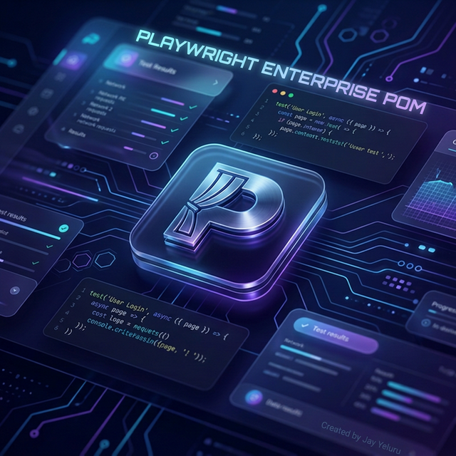
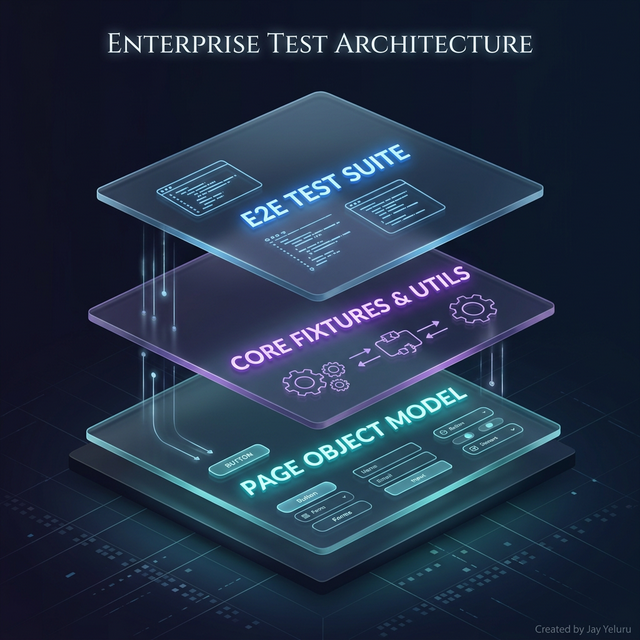

<div align="center">



# 🎭 Playwright Enterprise POM
### *Scalable, Resilient, and Data-Driven Automation*

[](https://playwright.dev/)
[](https://allurereport.org/)
[](https://github.com/features/actions)
[](https://prettier.io/)

---

Playwright Enterprise POM is more than just a test suite—it's a production-ready engineering solution for web automation. Built on the **Conduit RealWorld Demo**, it demonstrates advanced patterns for synchronization, session management, and environment-agnostic data sourcing.

[Technical Stack](#-tech-stack) • [Architecture](#-architecture) • [Env Strategy](#-environment--data-strategy) • [Quick Start](#-installation)

</div>

---

## ⚡ Technical Stack

*   **Core**: [Playwright](https://playwright.dev/) (Chromium, Firefox, WebKit)
*   **Language**: JavaScript (ES6+)
*   **Reporting**: [Allure 3](https://allurereport.org/) + Playwright HTML
*   **Design Pattern**: Page Object Model (POM) + Dependency Injection (Fixtures)
*   **Data Generation**: [@faker-js/faker](https://fakerjs.dev/)
*   **CI/CD**: GitHub Actions (Sharded Execution)

---

## 🏢 Architecture



### The Layering Strategy
-   **Test Layer**: Focuses on "What" to test. Decoupled from selectors.
-   **Fixture Layer**: The logic hub. Injects managers and handles setup/teardown.
-   **POM Layer**: The UI map. Atomic methods for single-responsibility interactions.
-   **Data Layer**: The fuel. Separates static configuration from dynamic test data.

---

## 🌐 Environment & Data Strategy

This framework supports a sophisticated multi-environment strategy:

### 1. Environment Switching
Tests can be targeted at `stage`, `beta`, or `prod` using the `TEST_ENV` variable:
```bash
TEST_ENV=prod npm run test:desktop
```

### 2. The Data Manager Hub
The `DataManager` resolves data based on the current environment:
-   **Dynamic Data**: On-the-fly generation using Faker (e.g., random user emails).
-   **Static Data**: Environment-specific keys (e.g., authentication credentials for Stage vs Prod).

---

## 📊 Reporting & Metadata

Every run generates an **Allure 3** report enriched with system metadata. 

| Automatic Metadata | Description |
| :--- | :--- |
| **Executor** | Detects if running on `Local Machine` or `GitHub Actions`. |
| **Platform** | Captures OS (Darwin, Linux) and Node.js version. |
| **Live Context** | Injects the active `BaseURL` and `TEST_ENV` into the dashboard. |

```bash
# Generate and open updated report
npm run allure:generate && npm run allure:open
```

---

## 🚀 Installation & Usage

<details>
<summary><b>1. First-time Setup</b></summary>

```bash
# Clone and install
git clone https://github.com/jay-yeluru/playwright-enterprise-pom.git
npm install
npm run install:browsers

# Configure overrides
cp env/.env.example .env
```
</details>

<details>
<summary><b>2. Execution Commands</b></summary>

```bash
# Standard UI Test run
npm run test:desktop

# Targeted Runs (Tags)
npx playwright test --grep @smoke

# Debug / UI Mode
npx playwright test --ui
```
</details>

<details>
<summary><b>3. CI/CD Insights</b></summary>

The GitHub Actions pipeline automates:
1.  **Parallel Sharding**: Splitting tests across multiple runners for speed.
2.  **Artifact Merging**: Consolidating results from all shards into one report.
3.  **GH Pages Deployment**: Automatic hosting of the latest Allure 3 dashboard.
</details>

---

## 📂 Project Blueprint

-   📂 `pages/` — UI Locators and Atomic Actions.
-   📂 `fixtures/` — Custom Fixtures (Dependency Injection).
-   📂 `data/` — Env-specific JSONs & Faker Generators.
-   📂 `utils/` — API Clients, Config Handlers, and Metadata Generators.
-   📂 `tests/` — High-level E2E Test Specifications.

---

<div align="center">

### Modern. Resilient. Data-Driven.

*Maintained by [Jay Yeluru](https://github.com/jay-yeluru)*

[](https://github.com/jay-yeluru)

</div>
